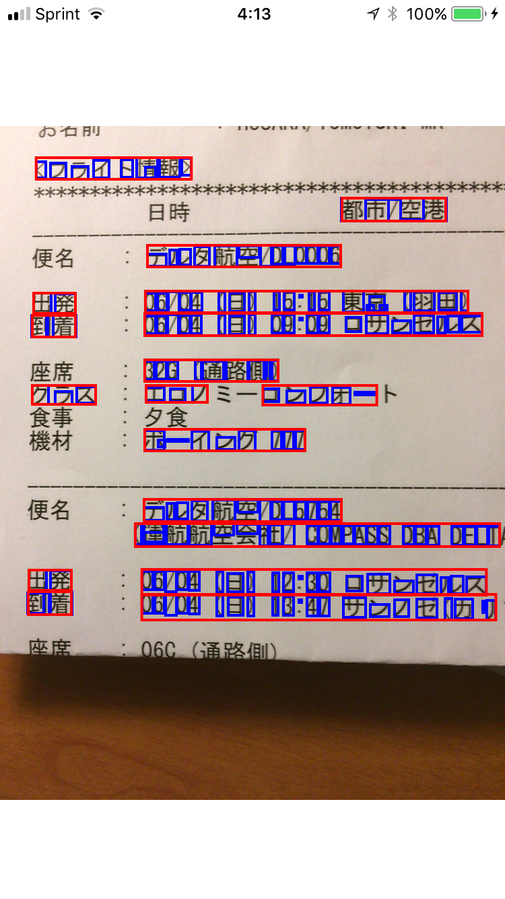

# TextDetectionSample-iOS

This sample project shows how to use Vision.framework to detect text rectangles with cameras.

Try open TextDetectionSample.xcodeproj on Xcode 9 beta.
This sample app supports iPhone/iPad devices w/ iOS 11.

## Screenshot

| English | Japanese |
| --- | --- |
|  |  |
